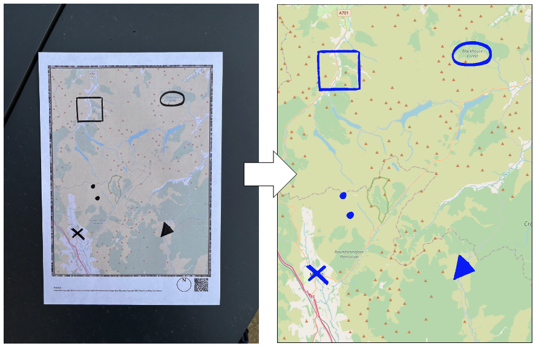
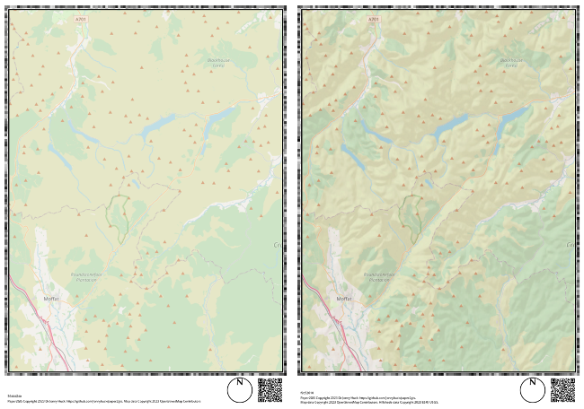

# Paper2GIS

Paper2GIS is a participatory GIS / mapping platform that allows participants to draw markup onto a paper map (using a **thick black marker pen**), which can then be automatically extracted into georeferenced Shapefile or GeoTiff datasets. This is intended to reduce the impact of *digital divides* on the collection of participatory map data. Paper2GIS was created in 2016 for students to use on a field course in the Indian Himalaya. It has since been used for a range of teaching research applications, some of which are listed in the [References](#references) section of this document. 

The basics of the extraction workflow is illustrated below: you simply generate a map, draw on it and take a photograph, then pass the photograph back to the software to extract it either to a Shapefile or a GeoTiff (Shapefile shown).



## Contents:

* [Notes](#notes)
  * [Notes on map generation](#notes-on-map-generation)
  * [Notes on map extraction](#notes-on-map-extraction)

* [Usage](#usage)
* [Installation](#installation)
  * [Mac](#mac)
  * [Ubuntu](#ubuntu)
  * [Windows](#windows)

* [Bulk Extraction of Shapefiles](#bulk-extraction-of-shapefiles)
* [Future Development](#future-development)
* [Licensing](#licensing)
* [References](#references)

## Notes

### Notes on Map Generation

Paper2GIS no longer supports map generation using Mapnik Stylesheets, as the Mapnik [Python Bindings](https://github.com/mapnik/python-mapnik) proved to be increasingly challenging for people to build and appear to have very limited support / development at the moment. Instead, you can now either:

* provide a map image that will be used instead. For now, I would recommend making your map **1084 x 1436 @ 96dpi**, and ensuring that there are no very dark areas (e.g. prominent black labels), which may be misinterpreted as markup. 
* provide your desired map bounds and Paper2GIS will generate a map for you using OSM map tiles. You control the desired zoom level of the map tiles that it uses, so that you can make sure that the map looks as good as possible. To get an idea, if you go to [OpenStreetMap](https://www.openstreetmap.org/), you can see the zoom level currently visible on the screen by looking at the URL. For example, if the URL is `https://www.openstreetmap.org/#map=18/2.78882/32.29586`, then the zoom level is **18** (the number that immediately follows `#map=`). The range is between `0` (for the whole world on a single tile) and `19` (the finest level of detail).If you are using the OSM tiles option, you can also add an optional **hillshade layer** courtesy of ESRI. An example of a Paper2GIS map with and without hillshade is given below:



* if you are using the OpenStreetMap tiles, you also have the optiojn of adding a boundary to your dataset (i.e., toi mark the extent of your are of interest). This is achieved by providing a path to a Shapefile containing the boundary as a polygon. It will be drawn as an outline, with the width, colour and opacity all editable using the options.

It is always good to thoroughly test a map using the extractor before using a Paper2GIS layout 'in the wild', and remember that the `extract` software has loads of settings to help make sure that you get a nice result, so don't panic if you don't get a perfect result first time with the default settings!

### Notes on Map Extraction

Markup can be extracted as-is (marked areas will become **polygons**), as **convex hulls**, as **centroids** (point representing the geometric centroid, irrespoective of whether or not it is contained within the original polygon), as **representative points** (point that is definitely inside the original polygon) or as **polygons from boundaries** (where only the boundary is marked on the map, but a filled polygon is extracted using either the exterior interior ring(s)). All extraction can be in the form of either a ShapeFile (`.shp`) or GeoTiff (`.tif`).

## Usage

Paper2GIS is accessed via a Python-based CLI package (`p2g.py`), the basic functionality is explained with the commands below. On a Mac or Linux machine, these commands can simply be typed into the the **Terminal**. on Windows, these commands should be run in the **Anaconda Prompt**. 

Note that **Terminal** / **Anaconda Prompt** should be pointed to your `Paper2GIS` directory (i.e., the directory containing `p2g.py`) before running any of these commands. This can be achieved by running the command `cd <PATH_TO_Paper2GIS>` (e.g., `cd /Users/user/Paper2GIS/`).

To view the basic functionality of `p2g.py`, you can type the following command:

```bash
python p2g.py -h
```

Which returns:

```txt
usage: Paper2GIS [-h] {generate,extract,test} ...

positional arguments:
  {generate,extract,test}
                        either: 'generate' to make a Paper2GIS layout; 'extract' to retrieve markup from a
                        photograph of a used Paper2GIS layout; or 'test' to test that a new installation
                        is functioning

options:
  -h, --help            show this help message and exit
```

This explains that there are three possible commands: `generate`, `extract` and `test`. Each es explained in more detail below.

### Create a Paper2GIS layout from a map image (`p2g.py generate`)

Before running any commands, you must activate the `paper2gis` environment:

```bash
conda activate paper2gis
```

Example call with a pre-existing map (`1084 x 1436px @ 96dpi`):

```
python p2g.py generate -a -2462672.600 -b 9330748.585 -c -2393838.600 -d 9421934.585
```

Example call with a map drawn using OSM tiles:

```
python p2g.py generate -a -2462672.600 -b 9330748.585 -c -2393838.600 -d 9421934.585 -o test2.png -t True -z 10
```

Full details:

```
usage: Paper2GIS generate [-h] -a BL_X -b BL_Y -c TR_X -d TR_Y [-e EPSG] [-r RESOLUTION] [-i INPUT] [-o OUTPUT] [-t {True,False}] [-f FADE] [-z ZOOM] [-s {True,False}] [-sa HILLSHADEALPHA] [-bf BOUNDARYFILE]
                          [-bw BOUNDARYWIDTH] [-bc BOUNDARYCOLOUR] [-ba BOUNDARYALPHA]

options:
  -h, --help            show this help message and exit
  -a BL_X, --bl_x BL_X  bottom left x coord
  -b BL_Y, --bl_y BL_Y  bottom left y coord
  -c TR_X, --tr_x TR_X  top right x coord
  -d TR_Y, --tr_y TR_Y  top right y coord
  -e EPSG, --epsg EPSG  EPSG code for the map CRS
  -r RESOLUTION, --resolution RESOLUTION
                        Resolution of the input map image (dpi)
  -i INPUT, --input INPUT
                        the input map image (file path) - this is ignored if --tiles=True
  -o OUTPUT, --output OUTPUT
                        the output data file (file path)
  -t {True,False}, --tiles {True,False}
                        create a OSM map (ignores --input)
  -f FADE, --fade FADE  intensity of the white filter over the tiles (0-255)
  -z ZOOM, --zoom ZOOM  requested zoom level of OSM tiles (necessary if using tiles)
  -s {True,False}, --hillshade {True,False}
                        add hillshade to generated OSM map
  -sa HILLSHADEALPHA, --hillshadealpha HILLSHADEALPHA
                        the alpha value for the hillshade layer
  -bf BOUNDARYFILE, --boundaryfile BOUNDARYFILE
                        a shapefile containing boundary data
  -bw BOUNDARYWIDTH, --boundarywidth BOUNDARYWIDTH
                        the width (in pixels) of the boundary line
  -bc BOUNDARYCOLOUR, --boundarycolour BOUNDARYCOLOUR
                        the colour of the boundary line
  -ba BOUNDARYALPHA, --boundaryalpha BOUNDARYALPHA
                        the alpha (opacity) of the boundary line
```

### Extract markup from an image of a used Paper2GIS layout (`p2g.py extract`)

Before running any commands, you must activate the `paper2gis` environment:

```bash
conda activate paper2gis
```

Example call for extraction:

```
python p2g.py extract --reference map.png --target in.jpg -o out.shp --threshold 100 --kernel 0
```

Full details:

```
usage: Paper2GIS extract [-h] -r REFERENCE -t TARGET [-o OUTPUT] [-l LOWE_DISTANCE] [-k KERNEL] [-i THRESHOLD] [-m HOMO_MATCHES] [-f FRAME] [-a MIN_AREA] [-x MIN_RATIO] [-b BUFFER] [-cc {True,False}]
                         [-cx {True,False}] [-cr {True,False}] [-ce {True,False}] [-ci {True,False}] [-d {True,False}]

options:
  -h, --help            show this help message and exit
  -r REFERENCE, --reference REFERENCE
                        the reference image
  -t TARGET, --target TARGET
                        the target image
  -o OUTPUT, --output OUTPUT
                        the name of the output file
  -l LOWE_DISTANCE, --lowe_distance LOWE_DISTANCE
                        the lowe distance threshold
  -k KERNEL, --kernel KERNEL
                        the size of the kernel used for opening the image
  -i THRESHOLD, --threshold THRESHOLD
                        the threshold the target image
  -m HOMO_MATCHES, --homo_matches HOMO_MATCHES
                        the number of matches required for homography
  -f FRAME, --frame FRAME
                        a frame to add round the image if the map is too close to the edge
  -a MIN_AREA, --min_area MIN_AREA
                        the area below which features will be rejected
  -x MIN_RATIO, --min_ratio MIN_RATIO
                        the ratio (long/short) below which features will be rejected
  -b BUFFER, --buffer BUFFER
                        buffer around the edge used for data cleaning
  -cc {True,False}, --convex_hull {True,False}
                        store convex hulls of extracted shapes?
  -cx {True,False}, --centroid {True,False}
                        store centroids of extracted shapes?
  -cr {True,False}, --representative_point {True,False}
                        store representative points of extracted shapes?
  -ce {True,False}, --exterior {True,False}
                        extract polygons from boundaries by extracting the outer ring
  -ci {True,False}, --interior {True,False}
                        extract polygons from boundaries by extracting the inner rings
  -d {True,False}, --demo {True,False}
                        the output data file
```

Note that the `-cc`, `-cx`, `-cr`, `-ce` and `-ci` parameters allow you to control what type of geometry output you get (without these, the markup is converted directly to polygons).

### Verify an installation (`p2g.py test`)

To test than an installation works, the easiest approach is to simply run the following commands in your **Terminal** (Linux/Mac) or **Anaconda Prompt** (Windows). This runs a simple test that will complete an image extraction of the markup on `test/target.png` and tell you how different it is to the reference version at `test/out.png` (the value should be close to 0%).

Note that **Terminal** / **Anaconda Prompt** should be pointed to your `Paper2GIS` directory (i.e., the directory containing `p2g.py`) before running any of these commands. This can be achieved by running the command `cd <PATH_TO_Paper2GIS>` (e.g., `cd /Users/user/Paper2GIS/`).

```bash
conda activate paper2gis
python p2g.py test
```

Which, if successful, will return something like (the percentage might vary slightly between platforms):

```txt
Running test image generation...
Generation works!
The result is 14.50% different to the reference version (up to 15% is due to the random border).


Running test image extraction...
Extraction works!
The result is 0.00% different to the reference version.
```

## Installation

The below examples use conda to manage the Python installations, but there is no reason that you could not do this with `pip`,  `virtualenv`, or any other similar package management / virtual environment system.

### Mac

Open **Terminal** and run through the following steps:

* Install X Code tools:

```bash
xcode-select --install
```

* Install Homebrew:

```
/bin/bash -c "$(curl -fsSL https://raw.githubusercontent.com/Homebrew/install/HEAD/install.sh)"
```

* Install C library dependencies:

```bash
brew install zbar opencv gdal geos imagemagick
```

* [Install Miniconda / Anaconda](https://docs.conda.io/projects/continuumio-conda/en/latest/user-guide/install/macos.html)

* Set up conda environment (note the need to use `pip` for `opencv-contrib-python`):

```bash
conda create -n paper2gis -c conda-forge -y python=3 numpy=1.26.4 fiona rasterio pyzbar qrcode pillow cartopy 
conda activate paper2gis
pip install opencv-contrib-python
```

* Get Paper2GIS:

```bash
git clone https://github.com/jonnyhuck/Paper2GIS
cd Paper2GIS
```

At this point, you should have a working installation that you can test with the following command:

```bash
python p2g.py test
```

Which, if successful, will return something like (the percentage might vary slightly between platforms):

```txt
Running test image generation...
Generation works!
The result is 14.50% different to the reference version (up to 15% is due to the random border).


Running test image extraction...
Extraction works!
The result is 0.00% different to the reference version.
```

### Ubuntu

Open **Terminal** and run through the following steps:

* Install C library dependencies:

```bash
sudo apt install libopencv-dev python3-opencv libgdal-dev gdal-bin libzbar0 libgeos3.10.2
```

* [Install Miniconda / Anaconda](https://docs.conda.io/projects/continuumio-conda/en/latest/user-guide/install/linux.html)

* Set up conda environment (note the need to use `pip` for `opencv-contrib-python`):

```bash
conda create -n paper2gis -c conda-forge -y python=3 numpy=1.26.4 fiona rasterio pyzbar qrcode pillow cartopy 
conda activate paper2gis
pip install opencv-contrib-python
```

* Get Paper2GIS:

```bash
git clone https://github.com/jonnyhuck/Paper2GIS
cd Paper2GIS
```

At this point, you should have a working installation that you can test with the following command:

```bash
python p2g.py test
```

Which, if successful, will return something like (the percentage might vary slightly between platforms):

```txt
Running test image generation...
Generation works!
The result is 14.50% different to the reference version (up to 15% is due to the random border).


Running test image extraction...
Extraction works!
The result is 0.00% different to the reference version.
```

### Windows

* Install the **Visual C++ Redistributable Packages** from [here](https://www.microsoft.com/en-US/download/details.aspx?id=40784). Note that you need to select the version that best suits your system: `vcredist_x64.exe` for 64 bit systems, `vcredist_x86.exe` for 32 bit systems, or `vcredist_arm.exe` for arm-based systems. If you are not sure and are using a relatively 'standard' laptop, it is likely that the one you need will be `vcredist_x64.exe`.
* Install GEOS and GDAL:

Download the [OSGeo4W Network Installer](https://trac.osgeo.org/osgeo4w/), run it and select **Advanced Install** &rarr; **Install from the Internet** and the accept the defaults on the **Select Root install Directory**, **Set Local Package Directory** and **Select your Internet Connection** pages. When you are asked to **Choose a Download Site**, choose the top option in the list.

Now, will be looking at a long list of things that you can install. Expand the **Libraries** and select the following options by clicking once on the **Skip** label next to the following (this changes it from Skip to the current version): 

* gdal: The GDAL/OGR library and commandline tools
* geos: The GEOS geometry library (Runtime)

Now click **Next** and the software will present you with a longer list of software that comprises the dependencies of your selected packages. Make sure the **Install these packages to meet dependencies** box at the bottom is ticked and click **Next**. The download process will begin and you may be presented with one or more license agreements that you must **Agree** before proceeding. When the **Installation Complete** message appears, click **Finish**.

* [Install Miniconda / Anaconda](https://docs.conda.io/projects/continuumio-conda/en/latest/user-guide/install/windows.html)

Now, open **Anaconda Command Prompt** and run through the remaining steps:

* Create the `paper2gis` Anaconda Environment

<!-- NOTE!: THE WINDOWS INSTALL COMMAND IS DIFFERENT TO THE OTHERS - PYZBAR NEEDS TO BE INSTALLED FROM PIP -->
```bash
conda create -n paper2gis -c conda-forge -y python=3 numpy=1.26.4 fiona rasterio qrcode pillow cartopy 
conda activate paper2gis
pip install opencv-contrib-python pyzbar
```

* Get Paper2GIS:
**Note:** If the below command (starting `git...`) doesn't work, this could be because the `git` software is missing from your system. To fix this, you can install Git from [here](https://git-scm.com/downloads/win). Select the **Standalone Installer**, and choose the 32-bit or 64-bit version as required by your system (if you are not sure, you will most likely need 64-bit). You may need to close an re-open the **Anaconda Command Prompt** for the command to work.

```bash
git clone https://github.com/jonnyhuck/Paper2GIS
cd Paper2GIS
```

At this point, you should have a working installation that you can test with the following command:

```bash
python p2g.py test
```

Which, if successful, will return something like (the percentage might vary slightly between platforms):

```txt
Running test image generation...
Generation works!
The result is 14.50% different to the reference version (up to 15% is due to the random border).


Running test image extraction...
Extraction works!
The result is 0.00% different to the reference version.
```

## Bulk Extraction and Shapefiles

Paper2GIS does not currently have any specific bulk data processing functionality. This can be achieved using a simple shell script, and example of which is given in [processor.sh](./in/processor.sh) and below:

```bash
#!/bin/bash

# this prevents an error for loops that match no file
shopt -s nullglob

# convert any iphone images to jpg and fix spaces in file names
for FILE in *.HEIC 
do 
    FILEJPG=`echo $FILE | sed "s/.HEIC/.jpg/"`
    convert -quality 100% $FILE $FILEJPG
    rm $FILE
done
 
# extract shapefiles
for FILE in *.jpg 
do

    # print name of current file
    echo $FILE

    # run the extractor
    FILENEW=`echo $FILE | sed "s/.jpg/.shp/"`
    echo python ../p2g.py extract --reference ../out.png --target $FILE -o $FILENEW
    python ../p2g.py extract --reference ../out.png --target $FILE -o $FILENEW
    echo ""
done

# unset shell option again
shopt -u nullglob

echo "done."
```

## Future Development:

I am planning to add the following features to Paper2GIS:

* Implement better support for layouts of different sizes and resolutions, including landscape layouts
* Implement batch processing for extraction
* Improved output cleaning for GeoTiff outputs (so that it is the same as for the Shapefile outputs)
* Automated version of the frame function where low number of matches are detected
* Built in handling for HEIC files (from iPhones)
* Handle polygons with holes in when using boundary generator
* Improve handling of boundary polygons that intersect the edge of the map
* The ability to draw maps from custom tile sources
* Automated histogram stretch for input images to improve definition of markup
* A QGIS Plugin to interface with Paper2GIS

If you would like to request a feature (or wish for one to be prioritised), you can do so by opening an [Issue](https://github.com/jonnyhuck/Paper2GIS/issues).

## Licensing

The software is licensed under the [GNU General Public License v3](LICENSE). Bundled with it is the Open Sans font, which is licensed under the [Apache License v2](resources/Apache_License.txt).

## References

Paper2GIS has been described in the following articles in the academic literature (* = open access):

### Journal Articles

[Denwood, T., Huck, J. J., & Lindley, S. (2022). Paper2GIS: improving accessibility without limiting analytical potential in Participatory  Mapping. *Journal of Geographical Systems*, 1-21.](https://link.springer.com/article/10.1007/s10109-022-00386-6) *

[Panek, J., Hennig, B., Huck, J. & Benediktsson, K. (2023) Geospatial technologies in hazard research and response – a case study of Paper2GIS in an international field course. Journal of Geography in Higher Education.](https://www.tandfonline.com/doi/full/10.1080/03098265.2023.2263750)

### Conference Papers

[Huck, J. J., Dunning, I., Lee, P., Lowe, T., Quek, E., Weerasinghe, S.,  & Wintie, D. (2017). Paper2GIS: a self-digitising,  paper-based PPGIS. In *Geocomp 2017: Proceedings of the 14th International Conference on Geocomputation*.](https://www.geog.leeds.ac.uk/groups/geocomp/2017/papers/80.pdf) *

[Denwood, T., Huck, J.J., & Lindley, S. (2021). Paper2GIS: Going postal in the midst of a pandemic. In *Proceedings of the 29th Geographical Information Science UK Conference*.](https://zenodo.org/record/4665392) *