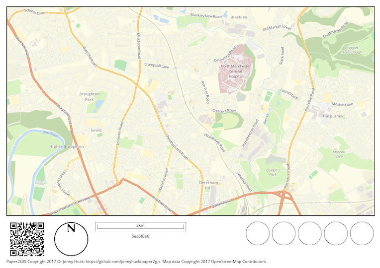

# Paper2GIS


Still a work in progress, please check back shortly for more information...

## Map Generator

### Setup

The map generator requires a .xml Mapnik Style Sheet. To get some examples follow the instructions [here](https://tilemill-project.github.io/tilemill/docs/guides/osm-bright-mac-quickstart/). In the downloading data stage, you will also want to do this:

```sh
wget http://mapbox-geodata.s3.amazonaws.com/natural-earth-1.4.0/cultural/10m-populated-places-simple.zip
```

Then, move the resulting style to the working directory and compile the .mml project into a .xml Mapnik Style Sheet using [carto](https://github.com/mapbox/carto):

```sh
cp ~/Documents/MapBox/projects/OSMBright > ./
carto OSMBright/project.mml > style.xml
```

You will then need to change the end of **line 407** of the resulting **style.xml** to:

```
.../10m-populated-places-simple/10m-populated-places-simple.shp", 
```

If you want the Blossom version of the style, then follow the simple instructions [here](https://github.com/stekhn/blossom), then compile the .mml project into a .xml Mapnik Stylesheet using [carto](https://github.com/mapbox/carto):

```sh
carto OSMBright/project.mml > OSMBright/style.xml
```

### Running

Example command:

```python
python mapgen.py -a -253416.76422779588028789 -b 7076444.70266312919557095 -c -244881.40985959535464644 -d 7080278.71288163959980011 -e 27700 -f out.png
```

would give:



`python mapgen.py -h` will give further information for now.

## Map Extractor

To extract data from an image, simply take a photograph of it like this (leave plenty of border around the page):


You can then extract the markup to a GeoTiff using:

`python mapex.py -r reference.png -m ref_map.png -t photograph.jpg -k 5`

Here is the result:


`python mapex.py -h` will give further information for now.

### Bulk Extraction and Shapefiles
**NB:** This step requires the **GDAL** binary installation

In most cases, you will want to extract many images at the same time and extract shapefiles rather than GeoTiffs. This can be achieved usng a simple shell script like this:

```bash
#!/bin/bash

# fix any spaces in file names
for f in *.jpg; do mv "$f" "${f// /_}"; done
 
# extract tifs and contours
for FILE in *.jpg
do
	FILENEW=`echo $FILE | sed "s/.jpg/.tif/"`
	echo python mapex.py -r reference_img.png -m reference_map.png -t $FILE -o $FILENEW -k 5 -b 30 -l 0.1 -c 90
	python mapex.py -r holly50k.png -m holly_50kmap.png -t $FILE -o $FILENEW -k 5 -b 30 -l 0.1 -c 90

	FILE2=`echo $FILENEW | sed "s/.tif/_tmp.shp/"`  # tmp file to be reprojected then deleted
	FILE3=`echo $FILENEW | sed "s/.tif/.shp/"` 		# result file

	# make polygons from the raster
	echo gdal_polygonize.py -q $FILENEW -f "ESRI Shapefile" $FILE2
	gdal_polygonize.py -q $FILENEW -f "ESRI Shapefile" $FILE2

	# fix the projection problem (not sure why this happens...)
	echo ogr2ogr -f "ESRI Shapefile" -s_srs "EPSG:3857" -t_srs "EPSG:54004" -overwrite  -where "DN = 0" $FILE3 $FILE2
	ogr2ogr -f "ESRI Shapefile" -s_srs "EPSG:3857" -t_srs "EPSG:54004" -overwrite -where "DN = 0" $FILE3 $FILE2

	# clean up the unwanted files
	echo "cleaning..."
	rm $FILE2
	rm `echo $FILE2| sed "s/.shp/.dbf/"`
	rm `echo $FILE2| sed "s/.shp/.shx/"`
	rm `echo $FILE2| sed "s/.shp/.prj/"`
	echo ""
done

echo "done."
```

An example of this is provided in [processor.sh](./processor.sh).