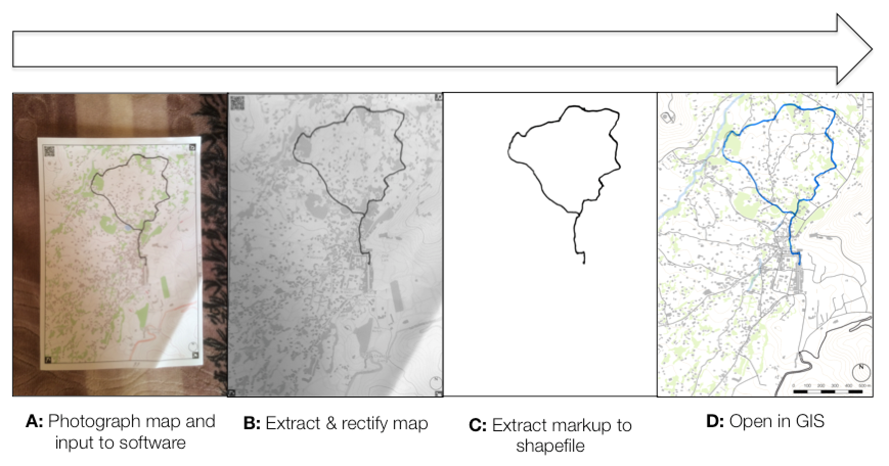

# Paper2GIS



Still a work in progress, please check back shortly for more information...

## Map Generator

### Setup

The map generator requires a .xml Mapnik Style Sheet. To get some examples follow the instructions [here](https://tilemill-project.github.io/tilemill/docs/guides/osm-bright-mac-quickstart/). In the downloading data stage, you will also want to do this:

```sh
wget http://mapbox-geodata.s3.amazonaws.com/natural-earth-1.4.0/cultural/10m-populated-places-simple.zip
```

Then, move the resulting style to the working directory and compile the .mml project into a .xml Mapnik Style Sheet using [carto](https://github.com/mapbox/carto):

```sh
cp ~/Documents/MapBox/projects/OSMBright > ./
carto OSMBright/project.mml > style.xml
```

You will then need to change the end of **line 407** of the resulting **style.xml** to:

```
.../10m-populated-places-simple/10m-populated-places-simple.shp", 
```

If you want the Blossom version of the style, then follow the simple instructions [here](https://github.com/stekhn/blossom), then compile the .mml project into a .xml Mapnik Spreadsheet using [carto](https://github.com/mapbox/carto):

```sh
carto OSMBright/project.mml > OSMBright/style.xml
```

### Running

Example command:

```python
python mapgen.py -a -253416.76422779588028789 -b 7076444.70266312919557095 -c -244881.40985959535464644 -d 7080278.71288163959980011 -e 27700 -f out.png
```

`python mapgen.py -h` will give further information for now.

## Map Extractor
### Setup
### Running